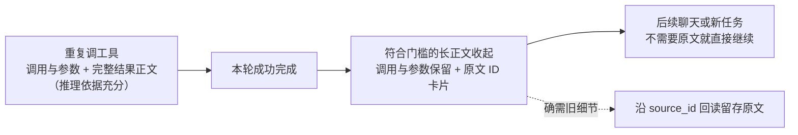
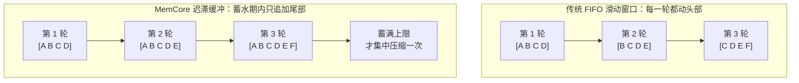
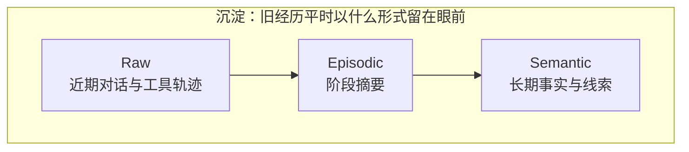
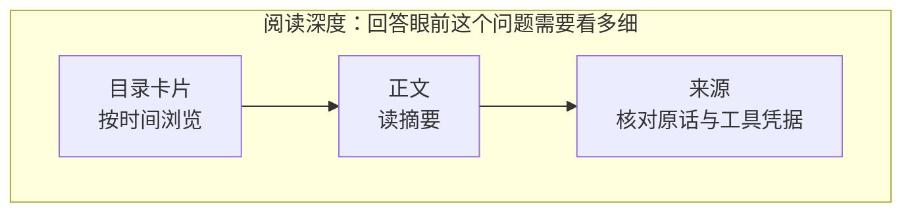

# memcore

面向长程 Agent 的开源 **Context Runtime**：管理哪些信息继续驻留在模型上下文里、哪些在任务结束后退出，以及需要时如何精确回读原始证据。

[English](README_EN.md) | [中文](README.md)

> **不是另一个“把聊天切块塞进向量库”的记忆层。**
>
> 工具执行期间保留完整结果；任务终局后把庞大正文结算为可回读卡片；未来真正需要旧细节时，再沿稳定 `source_id` 打开原文。
> MemCore 把对话、事件、工具轨迹和长期记忆放在同一条可追溯时间线上，同时尽量保持 provider 前缀稳定。

```text
20,000-token tool result
        ↓  terminal turn
~100-token reloadable card
        ↓  need exact evidence later?
open_memory(source_id) → original result
```

### 立即试一下

当前正式 PyPI distribution 名仍在发布前确认中；源码安装可立即使用：

```bash
git clone https://github.com/misaka-coder/memcore.git
cd memcore
python -m pip install -e ".[dev]"
python examples/settlement_demo.py
```

这个 Demo **不需要 API key**，会真实执行一次：完整工具结果驻留 → terminal settlement → 紧凑卡片 → `open_memory` 原文回读。

---

## 为什么需要 MemCore？

市面上多数 Agent 记忆框架，本质只是“把聊天记录切块塞进向量库”。在真实、长期的复杂人机协作中，这种朴素做法面临着三大致命困境：

1. **做完重活后的上下文爆炸**：AI 跑了 5 次代码排障、抓了 3 个网页，返回了几万字的原始工具输出。任务完成后用户想接着聊天，这些废弃的长结果依然霸占着上下文——不仅让模型注意力涣散、推理变慢，还会产生高昂的 API 账单。如果粗暴截断或删掉，后续想追问细节时又无从溯源。
2. **纯向量 RAG 的真实盲区**：人类对记忆的调取充满了时间与逻辑约束（“上周三讨论的方案”、“昨天下午报错的路径”）。纯向量检索在面对无明确语义特征、强时间依赖或冷门专有名词时频繁返回空或风马牛不相及的结果，导致模型在记忆问答中只能幻觉或声称忘记。
3. **Prompt Cache 频繁被击穿**：大模型服务商（DeepSeek、Anthropic、OpenAI）提供的 Prefix Caching（前缀缓存）是降低延迟和成本的唯一命脉。传统系统因频繁重写 System Prompt、不规则滑动窗口或动态上下文重排，导致缓存命中率归零，越聊越贵、越聊越卡。

**MemCore 为此而生：它不仅是一个记忆库，更是一个统一调度时间线、生命周期、模型投影与按需回溯的上下文操作系统。**

---

## 真实生产战绩（Battle-Tested In Production）

MemCore 不是停留在 Paper 或 Demo 里的理论模型。在深度角色伴聊与 64 个重度操作系统/编程工具同时挂载的单实例真实生产环境中，它交出了如下答卷：

* 🚀 **超长程高压运行**：在 **4.8w Token 的紧凑工作窗口限制下**，从容支撑超过 **16 天、51,000+ 条真实消息、3,900+ 轮任务**的高频连续交互。
* 📉 **惊人的上下文压减**：通过核心的**终局结算机制（Settlement）**，在保持执行期细节完整可见的前提下，任务完成后自动折叠长结果，**累计净节省 3,300,000+ Token 上下文，冗余压缩率达 68.3%**！
* ⚡ **极高的缓存复用率**：基于严格的字节级稳定前缀（Byte-identical Prefix），在多轮对话中实现了 **97%~98% 以上的输入前缀缓存命中率**（统计口径为*命中输入 tokens 总和 ÷ 总输入 tokens 总和*）。
* 🛡️ **轻量级单一真相源**：全程以 **SQLite 单文件作为唯一真相源**，无需配置重型向量数据库集群，不额外抢占本地 GPU 显存，断电依靠 WAL 事务与 Outbox 队列平稳自愈。

---

## 核心设计哲学与突破

### 1. 终局结算与渐进式回读（Settlement & Progressive Disclosure）



折叠的是**默认展示**，不是删除。原文仍保存在 SQLite 中，只是不再占据后续请求的上下文预算。

* **执行期（Open Turn）**：工具调用与大体量原始输出完整呈给模型，保证复杂多步任务推理拥有充分的信息依据。
* **终局完成后（Post-Final）**：启用 `compact_after_terminal` 策略后，庞大的结果自动折叠为一张**结算卡片**——包含时间、来源与 `source_id`，平均仅 100 Token。
* **按需瞬间回溯**：后续日常闲聊不受长文本干扰；某天用户突然追问“当时那个报错具体是哪一行”，模型可通过 `open_memory(memory_id=...)` 沿精准的 Lineage 血缘，瞬间把 25,000 字的原始执行轨迹调回前台！

### 2. 多路径自主记忆导航（Agentic Memory Navigation）
MemCore 坚信：**语义向量只是检索的加速器，绝不是记忆可达性的唯一通道。** 面对真实复杂提问，系统提供了一套互补的模型可调用工具箱：
* `retrieve_for_turn`：向量/BM25 混合检索 + RRF 融合重排，具备实体与属性的前置硬过滤（Prefilter），带时区裁剪。
* `browse_memory`：像翻看记事本目录一样，按时间跨度返回紧凑的阶段记忆卡片及标签覆盖范围。
* `open_memory`：顺藤摸瓜。支持看元数据（`card`）、读阶段正文（`content`）、或沿血缘展开原始对话/工具凭据（`sources`）。
* `read_timeline`：解决“昨天下午”、“上周二”等绝对或相对时间的精确时序核查，完整 Turn 无损分页。

四个工具**共用同一套时间锚**，这是它们能互相接力而不是各自为政的原因：`browse_memory` 卡片返回 `period_start_at` / `period_end_at`，`retrieve_for_turn` 的每条命中带 `timestamp`，`read_timeline` 与原始层渲染统一成 `[日期 2026-04-10 周五]` 格式，摘要与长期记忆则渲染成 `[时间范围 | ...]` 前缀。模型从任一入口拿到的时间证据，都能直接用于下一个入口的查询条件。

### 2.5 时间戳是记忆的一个维度，不只是元数据

很多系统把时间戳当作外围字段存着，MemCore 把它当作**贯穿三层记忆的检索与推理维度**。它同时解决四件事：

| 作用 | 具体表现 |
| --- | --- |
| **时间感知与陪伴感** | 模型知道一件事发生在何时、距今多久，能据此调整语气与反应，而不是只知有此事 |
| **自动排序** | 记忆天然获得先后顺序，避免“很多事混成一坨、只知道发生过却不知先后”导致的胡言乱语 |
| **可检索的坐标** | “上周二那件事”本身就是查询条件；模型先算日期再查时间线，而不是漫无目的地做模糊检索 |
| **抑制幻觉** | 时间锚点让模型能判断“这件事是否可能发生在这个时间”，而不是凭空补全一段没有时间依据的记忆 |

**闭环是怎么形成的**：摘要模型在提炼阶段摘要时被要求输出事件的时间范围（`[时间锚点规则]`，见 `memcore/prompts.py`），系统在底层把相对表达（“最近”“那几天”）标准化为绝对时间戳，并计算 `period_start_ts` / `period_end_ts` 作为兜底。于是标题、摘要、原文、长期记忆**各自都带可信时间**；模型带着自己的时间感知，先按时间范围翻目录、再读摘要、必要时回溯原文——每下一步的输入都能直接作为上一步的输出，不需要模型凭空猜测时间。

> 边界：源记录的时间范围由代码从记录本身计算，前提是宿主传入的时间正确；**话语中描述的事件日期仍需要模型正确理解**。时间锚点能显著减少时间类幻觉，但不会自动消除对时间表达的误解。

### 3. 写侧语义泛化 + 读侧精准子串汇聚（Fan-in Convergence）
为什么 MemCore 敢说“不依赖重型向量库也能跑出极高召回率”？
* **联合词池（Union Pool）互保容灾**：系统顺着血缘将“原始对话的实体词”与“阶段摘要的主题词”自动去重合并。原始细节保留了冷门专有名词（如模型权重、代码库、人名），摘要提供了高阶概念兜底，有效弥补单点打标的漏检风险。
* **单向子串包含（One-Way Substring）**：打破死板分词器与全等匹配的诅咒。已存的复合词（如 `文旅答辩项目`）可被精准的短查询（`文旅` 或 `答辩`）单向咬住；绝不引入无意义单字，零 NLP 库依赖。
* **多对一汇聚防爆炸**：由于同一话题的讨论往往在局部时序上相对密集，而数万 Token 的对话才凝练为一个阶段标题。底层即便涉及多次具体的对话痕迹，向上回溯到标题层时，**候选量通常会大概率收敛至数量有限的紧凑卡片**，既在底层放宽了召回覆盖，又在顶层避免了向模型倾倒海量原始细节导致的“扇出爆炸”。
* **证据回传（Witness）**：卡片附带原始命中依据（`keyword_hits`），让大模型看清“凭什么被召回”，清晰辅助二阶决策。

### 4. 极致的前缀缓存亲和力与双水位线迟滞缓冲（Prefix-Cache-First & Hysteresis Buffer）
为什么很多做了缓存的 Agent 在长程交互中缓存命中率依然很低？
* **传统 FIFO 滑动窗口的死穴**：固定保存 N 条消息，每加入一条就从头部踢出一条，导致历史 Token 的起始位置每轮都在前移，极易造成前缀缓存的高频击穿。
* **MemCore 的迟滞缓冲水库（High-Low Watermark）**：
  * **摘要层**设定 `[Min, Max]`（如 5~10 条）弹性区间：在 5 到 9 条期间只做纯尾部追加（Append-only），已有前缀历史在字节级别保持稳定，维持极高的前缀复用率；仅在蓄满 10 条时才触发压缩。**将前缀变动频率大幅稀释至 $\frac{1}{\text{Max} - \text{Min}}$**！
  * **Raw 对话层**以 Token 差值蓄水（如 8k~24k Token）：蓄水期内前缀保持稳定，只往尾部追加；到达上限才集中下刀回退到 8k 基线。
* 配合底层的 `ProjectionLedger` 与 Hash 锁定机制，绝不轻易篡改 System Prompt，**这是系统在真实生产中跑出 97%~98% 以上输入前缀缓存命中率的根本保证**。

> 命中的统计口径为*命中输入 tokens 总和 ÷ 总输入 tokens 总和*。上文的区间（摘要 5~10 条、Raw 8k~24k Token）为演示配置，并非包默认值；默认阈值与可见数量上限见 [配置 API 契约](docs/configuration_api_v1.md)。



上排每一轮的历史起点都在前移，前缀缓存逐轮击穿；下排在弹性区间内前缀字节级不变，只有尾部增长。前缀变动频率因此从"每轮一次"稀释到 $\frac{1}{\text{Max} - \text{Min}}$。

### 5. 三层记忆生命周期（Raw → Episodic → Semantic）





这两条线回答的是不同问题：上面管**历史的沉淀**，下面管**本次阅读的深度**。渐进披露的价值不依赖"三"这个层数来证明。

* **Raw（工作记忆）**：近期真实对话与原始工具轨迹，保留完整的原子时序。
* **Episodic Summary（阶段摘要）**：按 Provider 投影的 Token 差值触发，**严格在完整 Turn 边界切割**，避免把一句话或一个调用对切成两半。
* **Semantic Memory（长期事实）**：抽取长期偏好、稳定事实与待办。采用严格的强化合并机制——**仅当实体、主题、事实深度契合时才合并**，防止无关事件因为提到同一个人名而被错误焊死。

---

## 生态位与设计取向差异（Design Focus & Trade-offs）

开源社区中已有许多优秀的记忆框架，它们在各自的目标场景中表现出色。MemCore 并非要替代所有记忆系统，而是针对**高频长程对话与重度工具调用共生**这一特定工程挑战，选择了截然不同的架构取向：

| 维度 | Mem0 | Letta (MemGPT) | Zep / Graphiti | **MemCore** |
| :--- | :--- | :--- | :--- | :--- |
| **核心定位** | 用户画像与单点事实抽取 | 操作系统虚拟分页架构 | 时态知识图谱（Temporal Graph） | **统一时间线与上下文执行内核** |
| **主要目标场景** | 跨会话偏好记忆、个性化 CRM | 强自省、自主管理内存块的长驻 Agent | 复杂多实体关系演化与全局知识推断 | **日常长程伴随与复杂工具任务共存** |
| **长工具输出治理** | 聚焦对话与结论，不管理执行上下文 | 驻留历史或由模型调用工具存入归档 | 提取实体事实，不接管工具生命周期 | **原生终局结算（Settlement），折叠率超 68% 且支持原文无损回溯** |
| **上下文组织取向** | 动态检索并前置插入相关事实 | 动态编辑 Core Memory 内存块 | 检索匹配图谱子结构并注入上下文 | **字节级稳定前缀（Prefix-First），双水位线迟滞缓冲最大化缓存复用** |
| **检索与证据导航** | 向量相似度 + 图实体扁平搜索 | 工具搜索归档大文本 | 混合检索 + 图广度优先遍历（BFS） | **Agentic Navigation（混合检索 + 目录翻阅 + 血缘展开 + 精确时间线）** |
| **存储与运维依赖** | 外部向量库 / 托管服务 | PostgreSQL + 向量数据库 | 图数据库 (Neo4j / FalkorDB) + 向量引擎 | **单文件 SQLite（支持零外挂部署，带 Outbox 自愈）** |

---

## 选择接入方式

| 宿主需要什么 | 公开入口 | 接入说明 |
| --- | --- | --- |
| 给现有聊天循环补充可见记忆与读取工具，宿主继续组织历史 | `build_prompt_context()` / `render_prompt_context()` + 四种记忆读取工具 | [最小聊天示例](examples/minimal_chat_integration.py)、[使用流程](docs/usage_flow_v1.md) |
| 由 MemCore 提供模型可见的历史、当前输入与开放工具轮序列 | `build_context_surface()`，使用 `surface.messages` | [上下文契约](docs/context_surface_contract_v1.md)、[provider 支持表](docs/provider_support_matrix_v1.md) |
| 对已有 Session 接口使用上下文包装器 | `MemCoreContextSession.wrap(..., memory=mem)`，同时接入 `session.input_callback` | [Context Quickstart](docs/context_integration_quickstart_v1.md) |

使用 `surface.messages` 时，当前输入和历史已经在序列中，不应再附加一份相同 raw 渲染或工具轮。宿主仍负责系统/人格提示、模型传输、权限、工具执行和后台维护调度。

---

## 5分钟极速上手

```python
from memcore import (
    MemorySystem,
    MemoryConfig,
    Namespace,
    TimelineEntryInput,
    EntryOrigin,
    TurnRole,
)

# 1. 初始化系统（SQLite 负责持久化真相；Embedding 由宿主显式提供）
mem = MemorySystem(
    llm=MyLLMClient(),
    embedding=MyEmbeddingProvider(),  # 必填；可使用本地或 API embedding
    namespace=Namespace(user_id="u_001", conversation_id="c_001"),
    timezone="Asia/Shanghai",  # 强时区支持，消除相对时间歧义
    config=MemoryConfig(
        operation_projection_policy="compact_after_terminal",  # 开启长工具结果的终局结算
    ),
)

# 2. 开启一轮交互（传入用户输入）
handle = mem.begin_turn(stimuli=[
    TimelineEntryInput(
        kind="message.user",
        origin=EntryOrigin.USER,
        turn_role=TurnRole.STIMULUS,
        semantic_text="查一下今天北京的天气，然后告诉我。",
        payload={"text": "查一下今天北京的天气，然后告诉我。"},
    )
])

# 3. 构建并渲染模型可见的三层记忆上下文
ctx = mem.build_prompt_context(current=handle.stimuli[0].to_record())
prompt_text = mem.render_prompt_context(ctx)

# 4. 执行工具调用（Open Turn 期间结果完整记录）
mem.record_tool_exchange(
    turn_id=handle.turn_id,
    tool_name="web_search",
    tool_call_id="call_001",
    tool_input={"query": "北京今天天气"},
    result="北京今天 25°C，晴天，微风，空气质量优良……（此处省略数千字搜索结果）",
)

# 5. 提交模型最终回复（原子关闭轮次，触发长工具折叠）
mem.complete_turn(
    turn_id=handle.turn_id,
    semantic_text="北京今天天气晴朗，气温 25°C，非常舒适哦！",
)

# 6. 后台异步推进记忆分层压缩（不阻塞用户实时回复）
mem.compact_due_background()
```

---

## 原生工具循环与回溯机制

原生 tool calling 接入可用 `build_native_memory_tool_specs(...)` 生成工具 schema，再用 `dispatch_native_memory_tool(...)` 分发 `retrieve_for_turn` / `browse_memory` / `open_memory` / `read_timeline` / `load_material`：

```python
import json

tools = build_native_memory_tool_specs()

tool_payload = dispatch_native_memory_tool(
    tool_name=tool_call.name,
    arguments=tool_call.arguments,
    mem=mem,
    current=cur,
    material_loader=load_material_from_host_store,  # 宿主实现
    policy=ToolDispatchPolicy(
        allow_explicit_trace=True,
        allowed_kind_prefixes=("material",),  # 只开放产品已授权的 kind 前缀
    ),
)

# receipt 是宿主侧导航锚点；把其余完整结果作为 provider 原生 tool_result 回给模型。
provider_result = {key: value for key, value in tool_payload.items() if key != "receipt"}
provider_result_text = json.dumps(provider_result, ensure_ascii=False, sort_keys=True)

# 将模型实际看到的同一份结果写入 observation。
# compact_after_terminal 则只在本 turn final 后把 provider 历史换成可回读卡片。
mem.append_observation(
    turn_id=handle.turn_id,
    kind=f"operation.memory.{tool_call.name}.result",
    correlation_id=tool_call.id,
    semantic_text=provider_result_text,
    payload={"output": provider_result_text},
    retention_anchor=tool_payload["receipt"],
    status=tool_payload["receipt"]["status"],
)
```

---

## 给 AI 编码助手的入口

如果让 AI 编码助手接入本库，请先让它读取根目录 [`AGENTS.md`](AGENTS.md)，再读取 [`docs/ai_integration_checklist_v1.md`](docs/ai_integration_checklist_v1.md)。这份清单集中列出最容易漏掉并导致行为失真的硬规则：

- `MemorySystem` 必须注入 `LLMClient`、生产 embedding、有效 IANA `timezone` 和含 `user_id` 的 `Namespace`；
- timeline `kind` 必须是小写 namespaced value；普通工具采用 `tool.<lowercase_name>.call/result`；
- 需要模型回复的请求必须走 `begin_turn → action/observation → complete_turn/abort_turn`，不能用 standalone `record_user_turn()` 冒充开放 turn；
- 工具结果必须保存模型实际看到的同一份正文，并用相同 `turn_id/correlation_id` 关联；receipt 只能是小型回读锚点；
- `pending/partial/unavailable/conflict` 必须按结构化状态处理，不能改写成空结果或假成功。

---

## 公开边界：本库提供什么 / 宿主自备什么

MemCore 是**纯机制**：它不含任何具体人格、领域调教或模型权重。这条边界让它可以放心交付与授权。

| MemCore 提供（机制） | 接入方自备（你的资产） |
|---|---|
| 三层记忆、Token 压缩、强化合并、时间锚点 | 具体**人格文本**（经 `persona_text` / `PromptOverrides` 运行时注入） |
| raw-first 混合检索、可观测实体放宽、核心读工具与原生工具分发 | 你的**聊天模型**（`LLMClient` 只用于三层压缩，不介入读侧筛选） |
| 统一 metadata 契约 + 提示词骨架 + 校验插槽 | **领域补充说明**与**参数调优**（窗口/阈值） |
| 向量索引接口 + 三路适配器 + 语义自检 | **Embedding 模型**（本地 / API / 自有；构造 `MemorySystem` 时必须显式提供） |
| 命名空间硬隔离、outbox 自愈、定向遗忘、评测台 | 领域**合规规则**（MemCore 只保证记忆不越权变指令） |

> ⚠️ **隔离单位**：记忆的硬隔离边界是 Namespace 的 `hard_key`（`tenant_id / user_id / domain_id`）。`actor` 是软标签（群聊里“谁说的”），不进硬隔离、同一 `user_id` 下所有 actor 共享记忆池。要“按人隔离”，必须把人映射到 `user_id`。

---

## 严密验证与架构演进

MemCore 拥有极其严苛的工程自检防线：
* 全仓库包含 **45 个测试套件，611 个全绿自动化单测**，覆盖并发竞争、数据库全版本迁移与回滚、时区边界、Prompt 注入与 Outbox 故障自愈。
* 运行测试：
  ```bash
  uv run --extra dev python -m unittest discover -s tests -v
  uv run --extra dev ruff check .
  uv run --extra dev ruff format --check .
  ```
* 详细技术演进与设计推演见：
  * [`docs/design_story_and_video_v1.md`](docs/design_story_and_video_v1.md) — 设计思路与视频讲解底稿
  * [`docs/design_highlights_v1.md`](docs/design_highlights_v1.md) — 系统亮点与机制深度说明
  * [`docs/operation_projection_settlement_v1.md`](docs/operation_projection_settlement_v1.md) — 终局投影结算与回读规范
  * [`docs/agentic_memory_navigation_evaluation_20260806.md`](docs/agentic_memory_navigation_evaluation_20260806.md) — 线上真实导航审计报告

---

## 授权

MemCore 采用 [Apache License 2.0](LICENSE) 开源，SPDX 标识为 `Apache-2.0`。

你可以在遵守许可证条款的前提下自由使用、修改、分发和商业化 MemCore，也可以将它集成到闭源应用或 SaaS 中。Apache-2.0 同时包含明确的版权与专利许可条款；重新分发时请保留许可证及适用的版权、专利和归属声明。

