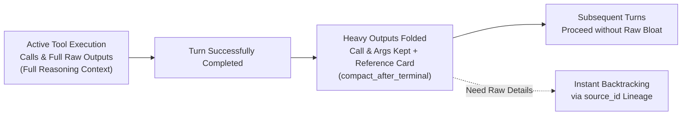
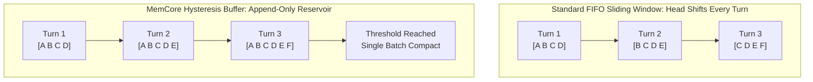
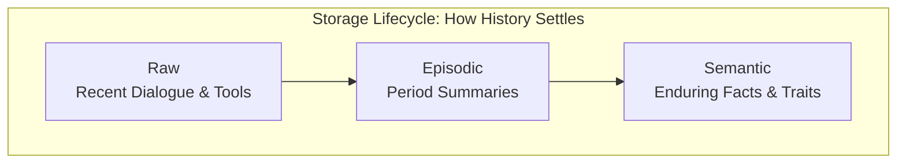
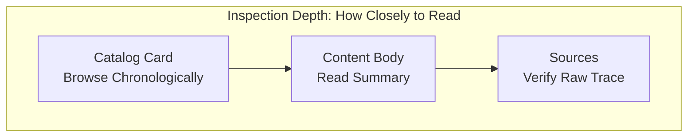

# memcore

A domain-agnostic, extensible, open-source **memory and context engine** engineered for long-horizon agentic conversations and complex tool execution.

[English](README_EN.md) | [中文](README.md)

> **"Let AI keep chatting, and keep doing."**
>
> After researching materials, running scripts, and completing tasks, users naturally continue the conversation or transition to the next objective.
> Voluminous intermediate tool outputs automatically fold upon terminal turn completion, minimizing everyday context bloat.
> When historical technical details are needed later, the raw observations can be reloaded instantaneously via stable content lineage IDs.
> Messages, platform events, tool trajectories, and file materials share a single causal timeline, granting long-term agents a continuous, unbroken operational history.

---

## Why MemCore?

Most agent memory frameworks today simply "chunk chat history and dump it into a vector database." In real-world, long-horizon human-agent collaboration, this naive approach faces three critical bottlenecks:

1. **Context Explosion After Heavy Execution**: An agent executes 5 troubleshooting runs and scrapes 3 web pages, yielding tens of thousands of tokens of raw output. When the user returns to casual chat, these retired outputs remain stuck in the prompt window—degrading reasoning quality, causing model distraction, and inflating API bills. Truncating or deleting them naively destroys historical traceability.
2. **The Vector RAG Blindspot**: Real human memory queries inherently contain strict temporal and causal constraints (*"the proposal we discussed last Wednesday"*, *"the file path that threw an exception yesterday afternoon"*). Pure vector similarity often returns irrelevant fragments or hallucinates when queries lack dense semantic features or involve rare proper nouns and time-sensitive questions.
3. **Prefix Cache Churn (Prompt Cache Busting)**: LLM providers (Anthropic, DeepSeek, OpenAI) offer prompt caching as the primary lever to reduce latency and inference costs. Traditional memory systems frequently rewrite system prompts, shift sliding windows unevenly, or dynamically reorder context snippets—dropping cache hit rates to zero and driving up costs with every turn.

**MemCore is built to solve this: not merely as a storage layer, but as a context operating system that unifies timelines, lifecycles, provider projections, and on-demand backtracking.**

---

## Battle-Tested in Production

MemCore is not a theoretical model confined to papers or toy demos. In a high-concurrency production companion deployment loaded with 64 native OS and programming tools, it achieved:

* 🚀 **Extreme Long-Horizon Resilience**: Under a compact working window cap of **48,000 tokens**, it continuously operated across **16+ days, 51,000+ real messages, and 3,900+ multi-step task turns**.
* 📉 **Remarkable Context Reduction**: Through its core **Terminal Settlement** mechanism, long execution traces are automatically collapsed into reloadable reference cards post-turn, achieving a **68.3% redundancy reduction and saving over 3,300,000+ context tokens** while preserving full detail during active turns.
* ⚡ **Ultra-High Cache Reuse**: Powered by byte-identical prefix stability and high-low hysteresis buffers, it sustained **97%~98%+ input prefix cache hit rates** across multi-turn sessions (*metric: total cached input tokens ÷ total prompt input tokens*).
* 🛡️ **Lightweight Single Source of Truth**: Uses **SQLite with WAL transactions as the sole source of truth**. Zero heavy vector cluster dependencies, zero extra GPU VRAM footprint, and self-healing crash recovery via transactional outbox queues.

---

## Core Architecture & Innovations

### 1. Terminal Settlement & Progressive Disclosure



Folding applies only to the **active context projection**, not storage. Raw outputs remain durably preserved in SQLite without consuming subsequent prompt token budgets.

* **Open Turn (Execution Phase)**: Tool calls and comprehensive raw results are fully projected to the model, ensuring sound reasoning during multi-step tasks.
* **Post-Final (Settlement Phase)**: With `compact_after_terminal` enabled, verbose observation bodies collapse into compact reference cards (~100 tokens) documenting execution status, timestamps, and a `source_id`.
* **On-Demand Lineage Reloading**: Routine chat stays light. If a user later asks *"What was the exact stack trace on line 42?"*, the model invokes `open_memory(memory_id=..., view="content")` to restore the full 25,000-character raw trace back into focus.

### 2. Multi-Path Agentic Memory Navigation
MemCore asserts that **semantic embeddings are an acceleration index, never the sole bottleneck of retrieval accessibility**. The model is equipped with a complementary suite of native tools:
* `retrieve_for_turn`: Hybrid dense vector + BM25 retrieval with Reciprocal Rank Fusion (RRF), hard attribute/entity pre-filters, and timezone-aware temporal bounds. Excludes visible context to prevent redundant recall.
* `browse_memory`: Chronological catalog exploration returning compact episodic/semantic cards and keyword coverage indicators across time spans.
* `open_memory`: Surgical inspection supporting compact metadata (`card`), summary bodies (`content`), or exact child lineage traces (`sources`).
* `read_timeline`: Exact chronological verification answering absolute or relative queries (*"yesterday afternoon"*, *"last Tuesday"*) with lossless turn-level pagination.

All four tools **share one time-anchor scheme**, which is why they chain into each other instead of operating in isolation: `browse_memory` cards carry `period_start_at` / `period_end_at`, every `retrieve_for_turn` match carries a `timestamp`, `read_timeline` and the raw tier render as `[日期 2026-04-10 周五]`, and summaries and long-term memory render with a `[time range | ...]` prefix. Time evidence obtained from any one entry point is directly usable as a query condition for the next.

### 2.5 Timestamps Are a Dimension of Memory, Not Just Metadata

Most systems store a timestamp as a peripheral field. MemCore treats it as a **retrieval and reasoning dimension that runs through all three memory tiers**, addressing four things at once:

| Role | How it shows up |
| --- | --- |
| **Temporal awareness and companionship** | The model knows when something happened and how long ago, so it can adjust tone and reaction — not merely that it happened |
| **Automatic ordering** | Memory gains a natural sequence, avoiding the incoherence that follows from a jumble of events with no known order |
| **A queryable coordinate** | *"That thing last Tuesday"* is itself a query condition; the model resolves the date first, then reads the timeline, instead of searching vaguely |
| **Hallucination suppression** | A time anchor lets the model judge whether an event could plausibly fall at that time, rather than inventing a memory with no temporal basis |

**How the loop closes**: the summarization model is required to emit the event's time range when it produces an episodic summary (the `[时间锚点规则]` block in `memcore/prompts.py`). The system then normalizes relative expressions (*"recently"*, *"those few days"*) into absolute timestamps and computes `period_start_ts` / `period_end_ts` as a fallback. The result is that catalogs, summaries, raw evidence, and long-term memory **each carry trustworthy time**; the model uses its own temporal awareness to browse a date range, read a summary, and drill into raw evidence as needed — the input to each step is directly obtainable from the output of the previous one, with no guessing.

> Boundary: a source record's time range is computed by code from the record itself, which assumes the host supplies correct timestamps; **an event date stated in dialogue still depends on the model interpreting that utterance correctly**. Time anchors sharply reduce temporal hallucination, but they do not automatically remove misinterpretation of time expressions.

### 3. Write-Side Tag Generalization + Read-Side Fan-in Convergence
Why does MemCore achieve high recall without complex semantic indexers?
* **Union Tag Pool**: During retrieval, MemCore dynamically unions raw entity anchors with high-level episodic summary tags. Raw details preserve obscure proper nouns (model weights, repository names, people), while summaries provide conceptual fallbacks.
* **One-Way Substring Matching**: Bypasses rigid tokenizers and brittle exact-equality constraints. A compound tag (e.g., `CulturalTourismDefense`) is matched by focused queries (`Tourism` or `Defense`). Substring matching is strictly one-way, avoiding meaningless noise while requiring zero NLP tokenizer dependencies.
* **Multi-to-One Fan-in Convergence**: Dialogue around a specific topic clusters locally in time. While thousands of conversation tokens produce multiple raw occurrences, they converge into a small number of episodic card titles. This broadens search recall at the base layer while preventing prompt context fan-out explosion at the presentation layer.
* **Witness Attribution**: Retrieved cards return explicit `keyword_hits`, allowing the LLM to inspect exactly why a memory node was selected.

### 4. Prefix-Cache-First Design & Hysteresis Watermark Buffers
Why do conventional agent memory systems suffer low cache hit rates?
* **The FIFO Sliding-Window Trap**: Standard sliding windows discard the oldest message whenever a new one arrives. Shifting the sequence start position every turn busts the LLM provider's prefix cache completely.
* **MemCore's Dual-Watermark Hysteresis Reservoir**:
  * **Summary Layer**: Employs an elastic `[Min, Max]` window (e.g., 5 to 10 entries). Between 5 and 9 entries, history is strictly append-only. The prefix remains byte-identical, preserving prompt cache. Compaction triggers only when reaching the upper watermark (10), reducing prefix invalidation frequency to $\frac{1}{\text{Max} - \text{Min}}$.
  * **Raw Conversation Layer**: Accumulates tokens within a configurable token band (e.g., 8k to 24k tokens). The prefix stays stable during accumulation, pruning back to baseline only when the ceiling is breached.
* Backed by `ProjectionLedger` and stable prompt hashing, system prompts remain unaltered turn-to-turn—guaranteeing **97%~98%+ input prefix cache hit rates** in production.



### 5. Three-Tier Memory Lifecycle (Raw → Episodic → Semantic)





* **Raw (Working Memory)**: Recent atomic dialogue turns, external events, and raw tool execution trajectories.
* **Episodic Summary (Episodic Memory)**: Triggered by provider token thresholds, cutting strictly on **clean Turn boundaries** to prevent bifurcated tool exchanges.
* **Semantic Memory (Long-Term Facts)**: Synthesizes stable user preferences, enduring profile attributes, and open commitments. Employs reinforcement merges—merging entries only when entities, topics, and facts strictly align.

---

## Architectural Comparison & Trade-Offs

MemCore does not attempt to replace all memory architectures. It is purpose-built for the intersection of **high-frequency long-horizon dialogue and heavy tool orchestration**:

| Dimension | Mem0 | Letta (MemGPT) | Zep / Graphiti | **MemCore** |
| :--- | :--- | :--- | :--- | :--- |
| **Core Architecture** | User profile & fact extraction | OS-style memory paging | Temporal Knowledge Graph | **Unified timeline & context execution kernel** |
| **Primary Target** | Cross-session personalization, CRM | Long-lived self-editing agents | Complex multi-entity graph reasoning | **Daily companion dialogue + intensive tool tasks** |
| **Heavy Tool Output Handling** | Focuses on final text; unmanaged tools | Retained in context or archived via tools | Extracts entities; unmanaged tool lifecycle | **Native Terminal Settlement (68%+ compression + lossless lineage reload)** |
| **Context Strategy** | Dynamic retrieval prepended to prompt | In-place core memory block editing | Subgraph retrieval injected into context | **Byte-identical Prefix-First with hysteresis buffers** |
| **Navigation & Evidence** | Embedding similarity + flat search | Tool-based text search over archives | Hybrid search + Graph BFS traversal | **Agentic Navigation (Hybrid RRF + Browse + Lineage + Lossless Timeline)** |
| **Storage & Infra Footprint** | External vector DB / Managed cloud | PostgreSQL + Vector extensions | Graph DB (Neo4j/FalkorDB) + Vector DB | **Single-file SQLite (Zero external services, Outbox self-healing)** |

---

## Installation

The distribution name is **`memcore-kernel`**; the import name remains `memcore`. The two need not match — same as `beautifulsoup4` / `bs4`.

> **Note**: the package named `memcore` on PyPI is unrelated to this project. Do not install it.

```bash
pip install memcore-kernel
```

Optional extras:

```bash
pip install "memcore-kernel[chroma]"       # Chroma vector backend (large deployments)
pip install "memcore-kernel[huggingface]"  # sentence-transformers local embeddings
```

`tzdata` is the only default dependency: time anchoring resolves IANA timezones through `zoneinfo`, and Windows ships no system tz database.

You can also install the latest development version from source:

```bash
git clone https://github.com/misaka-coder/memcore.git
cd memcore
pip install -e ".[dev]"
```

---

## 5-Minute Quickstart

```python
from memcore import (
    MemorySystem,
    MemoryConfig,
    Namespace,
    TimelineEntryInput,
    EntryOrigin,
    TurnRole,
)

# 1. Initialize the system (SQLite owns durable truth; the host provides embeddings)
mem = MemorySystem(
    llm=MyLLMClient(),
    embedding=MyEmbeddingProvider(),  # Required; local and API-backed providers are supported
    namespace=Namespace(user_id="user_001", conversation_id="conv_001"),
    timezone="America/New_York",  # Strong timezone support prevents relative-time ambiguity
    config=MemoryConfig(
        operation_projection_policy="compact_after_terminal",  # Enable post-turn tool folding
    ),
)

# 2. Open an interaction turn (User stimulus)
handle = mem.begin_turn(stimuli=[
    TimelineEntryInput(
        kind="message.user",
        origin=EntryOrigin.USER,
        turn_role=TurnRole.STIMULUS,
        semantic_text="Check the weather in Boston today and let me know.",
        payload={"text": "Check the weather in Boston today and let me know."},
    )
])

# 3. Build & render the 3-tier memory context for the model prompt
ctx = mem.build_prompt_context(current=handle.stimuli[0].to_record())
prompt_text = mem.render_prompt_context(ctx)

# 4. Record tool calls (Fully visible during the open turn)
mem.record_tool_exchange(
    turn_id=handle.turn_id,
    tool_name="web_search",
    tool_call_id="call_001",
    tool_input={"query": "Boston weather today"},
    result="Boston: 68°F, Partly Cloudy, Humidity 55%... (thousands of characters of raw text)",
)

# 5. Commit the assistant's final response (Atomically closes turn & triggers settlement)
mem.complete_turn(
    turn_id=handle.turn_id,
    semantic_text="It's currently 68°F and partly cloudy in Boston—great weather for a walk!",
)

# 6. Trigger non-blocking background compaction (Does not delay visible replies)
mem.compact_due_background()
```

---

## Native Tool Loop & Backtracking

To integrate native function calling, generate schemas using `build_native_memory_tool_specs(...)` and dispatch model calls through `dispatch_native_memory_tool(...)`:

```python
import json
from memcore import build_native_memory_tool_specs, dispatch_native_memory_tool, ToolDispatchPolicy

tools = build_native_memory_tool_specs()

tool_payload = dispatch_native_memory_tool(
    tool_name=tool_call.name,
    arguments=tool_call.arguments,
    mem=mem,
    current=cur,
    material_loader=load_material_from_host_store,  # Implemented by host
    policy=ToolDispatchPolicy(
        allow_explicit_trace=True,
        allowed_kind_prefixes=("material",),  # Expose only authorized namespaces
    ),
)

# Extract receipt for host navigation anchor; return remaining body to model
provider_result = {k: v for k, v in tool_payload.items() if k != "receipt"}
provider_result_text = json.dumps(provider_result, ensure_ascii=False, sort_keys=True)

# Persist the exact result the model observed
mem.append_observation(
    turn_id=handle.turn_id,
    kind=f"operation.memory.{tool_call.name}.result",
    correlation_id=tool_call.id,
    semantic_text=provider_result_text,
    payload={"output": provider_result_text},
    retention_anchor=tool_payload["receipt"],
    status=tool_payload["receipt"]["status"],
)
```

---

## Integration Guide for AI Coding Agents

If you are using an AI coding agent (Claude Code, GitHub Copilot, Codex, etc.) to integrate MemCore, instruct the agent to inspect [`AGENTS.md`](AGENTS.md) followed by [`docs/ai_integration_checklist_v1.md`](docs/ai_integration_checklist_v1.md).

Key contracts:
- `MemorySystem` requires an `LLMClient`, a production embedding provider, an explicit IANA `timezone`, and a `Namespace` with a non-empty `user_id`.
- Timeline entry `kind` identifiers must be lowercase namespaced strings (`tool.<name>.call/result`).
- Any conversational turn requiring a model response must follow the strict `begin_turn → append_action/observation → complete_turn/abort_turn` lifecycle.
- Tool observations must store the exact text the model received with matching `turn_id` and `correlation_id`.

---

## Boundary Contract: What MemCore Provides vs. What the Host Owns

MemCore is **pure mechanism**: it contains zero proprietary persona configurations, domain prompts, or model weights.

| MemCore Provides (Mechanism) | Host Implements (Your Application) |
| :--- | :--- |
| Three-tier memory, token compaction, reinforcement merging, time anchoring | Specific **Persona prompts** (injected at runtime via `persona_text` or `PromptOverrides`) |
| Raw-first hybrid retrieval, observable tag expansion, native tool dispatcher | Your **Chat Model** (`LLMClient` is used for background summaries, never for read-side filtering) |
| Unified metadata schema, prompt scaffolds, validation harnesses | **Domain specifications** and **parameter tuning** (window sizes, thresholds) |
| Vector index interfaces, multi-backend adapters, semantic self-check | **Embedding Provider** (Local or API-backed; must be supplied explicitly when constructing `MemorySystem`) |
| Hard namespace isolation, Outbox self-healing, targeted forgetting | **Compliance & Safety rules** (MemCore ensures memory data never executes as instructions) |

> ⚠️ **Isolation Boundaries**: Strict memory isolation is governed by the `Namespace` hard key (`tenant_id / user_id / domain_id`). An `Actor` is a soft speaker attribution label for multi-user chat; it does not isolate memory. All actors under the same `user_id` share the memory pool. To isolate individuals, map them to distinct `user_id`s.

---

## Verification & Test Suite

MemCore enforces rigorous engineering guarantees:
* Over **45 test suites and 611 automated tests** verifying concurrency, schema migrations and rollbacks, timezone bounds, prompt injection defense, and transactional outbox recovery.
* Run tests locally:
  ```bash
  uv run --extra dev python -m unittest discover -s tests -v
  uv run --extra dev ruff check .
  uv run --extra dev ruff format --check .
  ```
* In-depth technical rationale and design specifications:
  * [`docs/design_highlights_v1.md`](docs/design_highlights_v1.md) — System highlights and deep-dive mechanics
  * [`docs/operation_projection_settlement_v1.md`](docs/operation_projection_settlement_v1.md) — Terminal settlement and reload specification
  * [`docs/configuration_api_v1.md`](docs/configuration_api_v1.md) — Authoritative configuration and constructor contracts
  * [`docs/memory_read_api_v1.md`](docs/memory_read_api_v1.md) — Authoritative navigation and read API signatures

---

## Licensing

MemCore is open-source software licensed under the [Apache License 2.0](LICENSE), with SPDX identifier `Apache-2.0`.

Subject to the license terms, you may use, modify, distribute, and commercially deploy MemCore, including inside proprietary applications and SaaS products. Apache-2.0 also includes explicit copyright and patent grants; redistributions must retain the license and applicable copyright, patent, and attribution notices.

