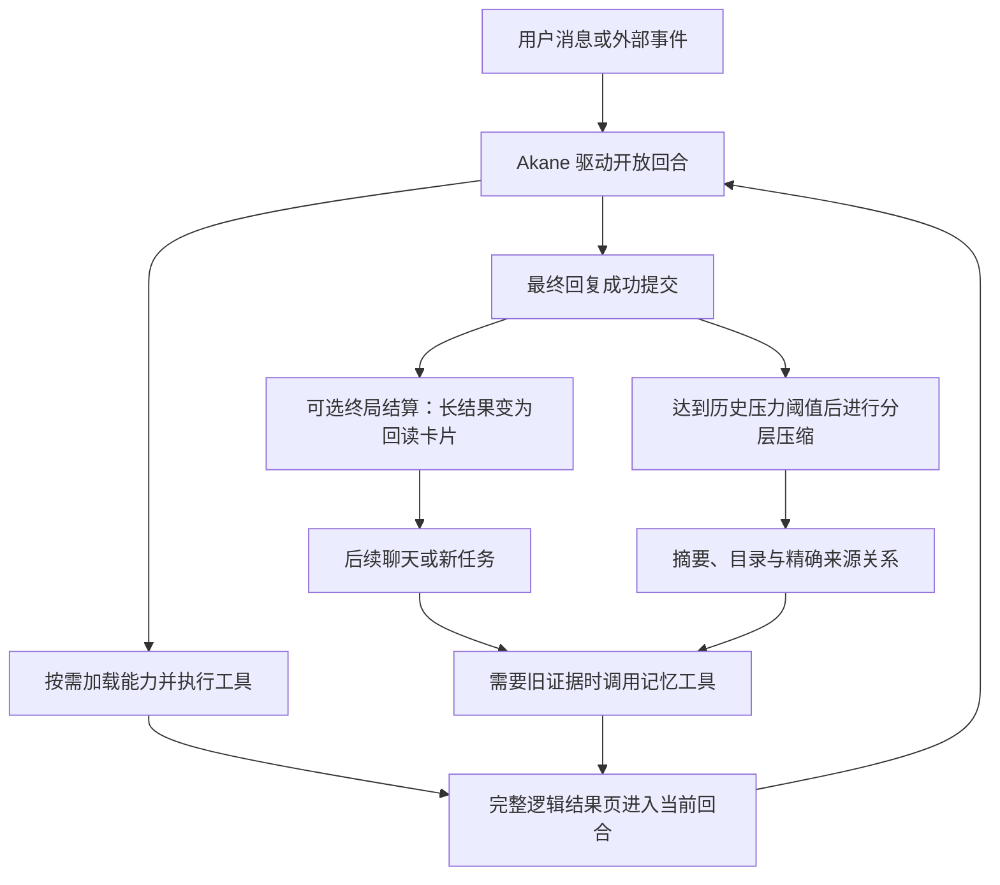

# Akane + MemCore：系统演进动机、关键机制与实验设计 V1

日期：2026-09-24。

本文系统梳理 Akane + MemCore 的架构演进动机、关键机制协同与学术研究设计。目标是阐明各项工程取舍背后的因果逻辑、机制如何紧密配合，以及后续实验验证方案。

第一次做论文研究，可从 [首轮实验入门与材料包](research/pilot_v1/README.md) 开始。已有 [多步长程真实模型实验结果](research/pilot_v4/actual_results.md)，包含实际压缩、历史回读和重启恢复。面向一般读者的系统全景与设计哲学见 [设计亮点与架构哲学](design_highlights_v1.md)。

## 1. 核心问题与设计动机

### 1.1 从长期记忆走向上下文管理

MemCore 最初的设计目标是为 AI 提供长期记忆能力。但在真实业务演进中，系统管理的对象逐渐扩展为消息、环境事件、工具调用及大体量执行结果，目标也随之升级为**通用的上下文管理内核**。

在长程人机交互中，同一个持续会话往往需要同时承载日常闲聊陪伴、查资料、编写代码和系统排障等重型任务。任务结束后，用户期望的是在同一会话中自然而然地继续聊天，或者随时重新追问之前任务的细节，而不是割裂成不同窗口。

### 1.2 工具轨迹治理的三种取舍

围绕工具执行大体量输出的治理，系统在设计初期深入权衡过以下三种常见方案的得失：

| 方案 | 潜在缺陷与痛点 |
| --- | --- |
| 任务后直接移除工具轨迹 | 后续聊天难以理解当时做过什么，用户一旦追问细节便产生严重割裂与失忆 |
| 完整保留全部工具结果 | 许多长结果在任务结束后暂时不再使用，却长期霸占上下文，稀释注意力并推高成本 |
| 直接粗暴截断结果 | 虽然减少了占用，但被截去的细节缺乏回读路径，后续真正需要时已永久丢失 |

由此确立的核心设计原则是：**执行中信息完整可见，毫不吝啬；执行结束后结构化收敛为紧凑卡片；后续需要细节时沿明确血缘路径回读。**

### 1.3 三层记忆的本质是“渐进式披露”的阶梯

时间线、时间锚点和终局结构化折叠是系统最核心的设计基石。三层记忆（Raw → Episodic → Semantic）纯粹是为了支持历史自然沉淀与渐进式披露（Progressive Disclosure），并非为了学术形式化而分层。

目录提供极轻量的一句话线索，模型按需打开阶段摘要，确认需要深挖字句时再追溯原始对话或执行证据。这种渐进式展开极大降低了日常交互的常驻 Token 负担。

在常规使用中，工具任务完成并成功回复后，多数后续交互不会再反复重读那些冗长的工具原文；偶尔追问旧细节时，卡片保留的 ID 提供了秒级回读路径。因此，终局结算卡片的核心价值在于降低日常交互驻留量，而非强制每轮去召回。

### 1.4 研究对象：Akane 与 MemCore 构成的共生系统

Akane 与 MemCore 共同构成了一套完整的智能体交互与上下文管理系统。工具结果、Skill 等动态内容通过尾部加载以最大化保持历史前缀稳定，是贯穿整个系统的核心设计主线。

## 2. 系统边界与总览

本文暂将研究对象描述为：

> 面向长期聊天与工具任务混合交互的系统：依据当前工作阶段调整历史信息的展示粒度，同时保留时间、来源和按需回读路径，并减少不必要的上下文改写。

这是研究定位，不是已经证明的效果结论。

| 部分 | 本文关注的职责 |
| --- | --- |
| Akane | 角色与产品交互、模型请求、工具发现和执行、权限、材料原件、UI/TTS、回合完成与交付 |
| MemCore | 时间线和关系、原始证据存储、provider 历史投影、分层压缩、目录/检索/来源展开、可选终局结算 |
| 聊天模型 | 理解当前意图、选择工具、判断是否需要更多证据、生成回复及可选记忆标注 |
| 模型与工具提供方 | 模型推理、实际缓存行为，以及各工具自身的数据获取与分页能力 |

Akane 已有实际链路把模型收到的工具反馈保存到 MemCore，并从 MemCore 获取后续开放工具轮的历史投影。这个接入事实支持将它们作为同一系统分析，但不能代替完整运行和效果验证。

下面是概念生命周期，不是要求宿主机械执行的固定工作流：

## 3. 机制及其相互作用

### 3.1 把证据留存与当前展示量分开

**实现事实：**启用 `compact_after_terminal` 时，成功提交 final 后，符合条件的长 observation 可以变成带 `source_id`、状态、哈希及回读参数的卡片。原始存储正文保持留存，当前开放工具轮不提前进行这种结算。

当前默认策略仍为 `full_until_raw_compaction`；本节描述的终局卡片化需要显式启用，不应把后文的默认收益门槛误读成该策略默认开启。

卡片由确定性规则生成，不需要额外 LLM 摘要。当前 MemCore 默认门槛为：正文小于 256 UTF-8 字节时直接保留；其他结果仍需卡片严格节省超过 50% 字节才替换。门槛可配置，字节收益不能直接当作供应商 token 或费用收益。

**回看解释：**系统不必准确预测某段结果以后是否永远无用。只要当前回合已经结束、正文仍有回读路径，就可以降低其默认展示量，推迟“以后是否需要”的判断。

**边界：**可恢复指重新读取仍留存且有权限访问的正文，不是从卡片反演原文。删除、材料原件缺失或权限变化都可能使回读不可用。语义摘要本身也仍然有损。

依据：[终局结算契约](operation_projection_settlement_v1.md)、[结算实现](../memcore/settlement.py)、[跨轮回读测试](../tests/test_slice3_settled_history.py)。

### 3.2 调用记录提供线索，卡片提供地址

系统之所以在终局结算时保留完整的工具调用和参数，是为了让模型在后续回读时清晰获知当时执行过什么、传入了什么参数，从而准确选择应该加载的目标结果。

**实现机制：**终局结算主要替换 observation 正文，保留调用部分和调用关系。后续统一 raw 压缩仍可能将操作轨迹转成 digest，因此完整参数并不永久驻留于可见上下文。

**系统设计考量：**在多个相似工具调用之间，参数是模型甄别历史证据的核心辨认线索。回读能够取得当时的观察快照，而重新执行原工具往往会得到已经变化的状态。历史事实核验与当前状态更新在系统中明确分流。

### 3.3 时间、访问粒度和来源关系互相配合

**实现机制：**阶段摘要的时间范围来自源记录时间的最小值和最大值；长期语义记忆继承源摘要范围。模型生成的时间标签与系统确立的绝对时间范围是不同字段。

读取提供两种互通的展开方式：

- 同一节点的详略：`card → content`。
- 结论到证据：semantic 的来源摘要 → episode 的来源 raw 逻辑单元。

`browse_memory` 提供按时间范围选择的目录，不依赖语义 Top-K。卡片除标题外，还可包含用途提示、主题、参与者、时间范围、来源数量和展开状态。`open_memory(sources)` 沿保存的来源 ID 展开；`read_timeline` 用于按已知时间或邻近轮次查看经过。

**系统设计考量：**时间帮助定位历史，目录帮助选择候选，摘要帮助判断是否已经足以回答，精确来源帮助核验。模型可以根据需求自由切换路径，而无需把单次语义检索当作唯一入口。

**边界控制：**记录时间正确依赖宿主输入；“某日说昨天发生了某事”的事件日期仍需模型正确理解。目录的覆盖统计相对于已存历史，`page_complete` 与历史 `coverage` 保持严格语义隔离。

依据：[读取契约](memory_read_api_v1.md)、[目录卡片实现](../memcore/memory_catalog.py)、[时间锚实现](../memcore/time_anchor.py)。

### 3.4 层级沉淀与渐进披露是不同维度

三层记忆结构是实现渐进式披露的工程手段：

**实现机制：**raw → episodic → semantic 控制历史默认表示的演变；card → content → sources 控制当前问题需要读到多细。源记录与来源摘要会继续留存，并不会因为进入上层就被物理删除。

第三层当前保存稳定事实、反复主题、重要人物和未完成事项，并支持强化融合。其本质是从阶段经历中提炼跨阶段仍有意义的信息。

依据：[分层压缩实现](../memcore/compaction.py)、[摘要与强化提示词](../memcore/prompts.py)。

### 3.5 Token 衡量压力，完整关系约束切点

由于消息条数无法稳定反映实际体积，单纯按 Token 硬截又会斩断正在运行的工具调用对，因此系统确立了**“用 Token 决定压缩量，用完整关系条目决定边界”**的原则。

**实现机制：**系统严格按完整 terminal turn 和相互交错的关系组件选择最旧前缀，避免拆散刺激、动作、结果和最终回复。开放组件会阻塞相应切分。

计划压缩量为 `ceil(raw_token_trigger × raw_token_batch_ratio)`，比例的分母是触发阈值，不是任意时刻的积压总量。切点对齐后，实际压缩量与完整轮次对齐。单个超大的已结束 turn 也有整体处理边界。

典型配置如 24,000 Token 触发线与 0.67 比例；阶段摘要达到 10 条后处理最旧 5 条，可见窗口可单独配置。

**系统设计考量：**资源压力交给 Token 衡量，允许在哪里改变历史表示则交由因果关系组件严格约束。

依据：[raw token 策略](raw_token_compaction_policy_v1.md)、[配置](../memcore/config.py)、[压缩规划器](../memcore/compaction.py)。

### 3.6 减少重复展示，同时保留深入读取的入口

**实现机制：**`retrieve_for_turn` 排除当前可见节点和相应派生祖先，但不会因为摘要已经可见，就封死其下游 raw。一次检索同时命中原文与共享来源的派生内容时，还有来源去重与 raw 优先规则。

**系统设计考量：**“已经看到概要”不等于“已经看到细节”。去重机制旨在减少缺乏新证据的重复展示，同时保留对底层更细粒度证据的按需访问通道。

依据：[检索实现](../memcore/retrieval.py)、[非对称来源排除测试](../tests/test_visible_lineage_asymmetric.py)。

### 3.7 JSON 标注复用当前理解，统一时间线保留信息身份

**实现机制：**最终输出可以包含 `speech` 和 `memory_metadata`。后者标注宿主指定的用户消息或触发事件，不标注 assistant 回复本身；工具调用不套最终回复 JSON 契约。

metadata 中的实体、主题和回答类型可以帮助未来检索，不需要强制再调用一个逐轮标注模型。标注缺失或无效也不会让普通合法记录失去默认检索资格，显式过滤才会相应缩小候选。

工具读取旧记忆所得的 observation 仍属于本次操作轨迹。操作 digest 默认显式检索，且 `semanticize=False`。

**系统设计考量：**系统保留“旧事件”和“今天读取旧事件”的区别，有助于减少回读内容反复作为新普通事实沉淀。

依据：[输出契约](chat_output_adapter_v1.md)、[metadata 定义](../memcore/schema.py)、[操作摘要实现](../memcore/compaction.py)。

### 3.8 缓存复用与历史缩减按阶段配合

工具结果、Skill 和部分能力信息在需要时加载到上下文尾部，是为了让前面已经稳定的内容更容易复用缓存。

窗口的较低水位与触发上限之间留出弹性增长空间（迟滞水库），也是为了减少前缀改写。相较于满额后每次移除最旧内容，raw 到达阈值再集中整理、摘要积累到上限再合并一批，让中间的许多请求只需要追加。

在实际使用中，系统录得约 97%~98% 及以上的输入缓存命中率（统计口径为“命中输入 tokens 总和 ÷ 总输入 tokens 总和”）。推导、统计口径与图解见 [视频分镜 V2](video_storyboard_v2.md)。

**实现事实：**MemCore 保存已冻结的 provider 投影，只为新增条目生成后续表示，并有严格前缀测试。Akane 的 Skill 正文通过工具返回；已经进入权威时间线的部分信息会停止额外快照注入。

这里需要区分几种不同情况：

| 情况 | 当前处理方式及限制 |
| --- | --- |
| 普通开放工具轮 | 新调用与结果追加，已有冻结投影尽量保持稳定 |
| Skill 正文加载 | 作为工具结果披露，不要求改写稳定 system 内容 |
| 能力目录变化 | 使用本代 base 与最新完整 update；旧 update 可能退出投影，不是永久纯追加 |
| 已知 MCP 工具复用 | `invoke_mcp` 或准确历史别名路由可不扩展 provider schema |
| `load_mcp` 激活动态工具 | 有路径把动态 handler 加入工具 schema，仍可能影响缓存前缀 |
| 终局卡片化或 raw 压缩 | 改变相应历史表示；修改位置之后的旧前缀匹配需重新建立 |

**回看解释：**执行密集阶段优先完整信息与前缀复用，后续阶段降低长期驻留量。缓存减少重复处理的成本，压缩减少上下文占用，两者不是同一个指标，也不保证同时单调改善。

**待验证假设：**这种阶段安排在持续聊天与工具任务混合的工作负载下，能否同时改善总体成本、延迟和证据恢复，需通过实际请求验证。

稳定前缀与延迟工具加载已有公开实践，不能仅凭本机制声称首次提出。MemCore 的冻结表示、局部 hash 或测试断言也不能证明实际供应商命中；最终序列化、模型、工具 schema、缓存生命周期和请求顺序仍会影响结果。

依据：[投影账本](../memcore/projection.py)、[投影测试](../tests/test_projection_cache.py)、[终局结算契约](operation_projection_settlement_v1.md)。外部已有实践见第 7 节，Akane 侧代码入口见 [宿主接入代码索引](host_integration_code_index_akane_v1.md)。

## 4. 值得研究的整体作用与限制

### 4.1 对两类连续性的支持

**回看解释：**日常聊天中可能有数日后仍相关的偏好、关系和约定；工具任务会在很短时间内产生大量结果。统一管理需要同时考虑：

- 做完任务后，之前的聊天事实是否仍能用于回答。
- 继续聊天后，之前的任务证据是否仍能恢复。

启用终局结算时，raw token 规划采用实际 settled 投影尺寸。工具长结果收起后，可能延缓其它近期 raw 因总量压力而进入摘要。这是“减少任务对聊天上下文挤占”的一个具体机制，效果尚待测量。

### 4.2 当前可以与不可以主张什么

| 可按现有证据描述 | 仍不能直接主张 |
| --- | --- |
| Akane 与 MemCore 已有真实接入实现 | 已证明优于通用编程 Agent 或所有记忆系统 |
| 关闭 turn 后可按策略生成回读卡片 | 系统自动知道整个用户任务客观完成 |
| 提供时间、目录、来源与语义检索多种路径 | 模型必然选对路径、找齐证据或正确归因 |
| 支持长会话中历史逐步沉淀与回读 | 任意长度开放工具轮都不会超出上下文 |
| 源时间范围由代码继承 | 所有自然语言事件日期绝对正确 |
| 可减少重复注入并保持部分前缀稳定 | 缓存必然命中，压缩必然更便宜 |
| 为陪伴与工具任务共存提供基础 | 已证明陪伴感、人格一致性或用户满意度提升 |

内建时间线可以按完整逻辑单元分页，但单个过大单元仍可能超预算；全文读取和第三方工具也不自动获得任意粒度分页。连续翻页的累计输入、系统提示、工具定义及输出预留，都需要完整宿主预算考虑。

### 4.3 状态与回读的已知边界

本次检查仍发现长期强化对 `open_loops=[]` 使用 `or fallback`，可能重新填回已经应当清空的旧事项。它是正式测试长期状态更新前需要处理的具体缺口；本文未修复代码，也不把长期记忆字段存在等同于状态维护正确。

回读全文不会必然产生“卡片套卡片、每次多一跳”的链：新 observation 保存实际读回的正文，之后可直接打开这条正文。不过反复回读会增加读事件与可能的正文副本，存储增长和重复回读成本也值得记录。

## 5. 研究问题与验证方式

### 5.1 主研究问题

> 在长期聊天与工具任务交替发生的持续会话中，按工作阶段调整历史证据的展示粒度，能否降低上下文和计算成本，同时保持聊天事实与任务证据的可恢复性？

这是一项候选研究问题。Akane 提供完整交互环境，MemCore 提供可拆解的机制，实验应定位具体机制的作用。

| 编号 | 待验证假设 | 应包含的反例 |
| --- | --- | --- |
| H1 | 终局卡片降低已完成任务的历史驻留量，并减少其对聊天 raw 的挤占 | 任务后立刻连续追问导致反复全文回读 |
| H2 | 调用参数帮助模型识别正确历史结果 | 同一工具多次相似查询、相同名字但不同参数 |
| H3 | 目录与精确来源在语义入口失灵时提供有效退路 | 候选标题模糊、来源缺失、覆盖不完整 |
| H4 | 稳定投影与按需加载降低不必要的前缀变化和计算成本 | MCP schema 变化、目录更新、结算和压缩换代 |
| H5 | 第三层改善跨阶段主题或事实回答 | 已取消任务、改变的偏好、旧印象压过最新证据 |

### 5.2 恢复检查与常规收益分别评估

以下保留早期两个可逐条核验脚本场景的设计，用于验证记录、评价与恢复路径。它们刻意包含旧证据追问，不能据其均值推断常规使用收益。2026-09-14 补充的常规评估设计列在本节后半。

每个场景至少包含以下阶段：

1. 日常聊天：明确记录一项偏好、一项约定和相应时间。
2. 工具任务：调用同一工具的不同参数，返回带可核验细节的长结果；必要时分页。
3. 任务回复：宿主成功提交 final，再进入后续阶段。
4. 间隔聊天：若干轮与原任务无关的对话，使任务结果暂时没有使用价值。
5. 延迟追问：分别询问聊天事实和旧任务中的精确细节。
6. 状态变化：更正偏好或取消事项，检查是否继续沿用旧状态。

历史工具快照与当前工具状态可以刻意设置为不同值，用来区分回读旧证据与重新执行工具。

主试验先使用确定性工具 fixture，避免实时网页或搜索排序变化混入机制比较。精确追问应包含 final 未直接透露、但原工具结果确实包含的细节；同时保留一些从现有上下文即可回答的问题，用来测量不必要的回读。成功 final、预算耗尽结束和提前结束应分别标记，不能合并成同一类“任务完成”。

后续应把常规驻留收益作为独立实验，至少区分三类任务后续：

| 后续交互 | 如何安排 | 主要观察 |
| --- | --- | --- |
| 不再使用旧工具正文 | 正常聊天或独立的新任务，不强制追问上一份资料 | 后续请求累计驻留 token、近期聊天保留情况、任务质量、不必要回读 |
| 有追问，但可见内容已经足够 | 询问 final 已说明的结论或安排 | 模型能否直接回答，是否因看到卡片反而主动加载无关正文 |
| 确需旧工具原文 | 询问可见回复与摘要没有包含的旧版细节 | 来源正确率、读取与回答质量、额外请求和延迟 |

固定每个已完成工具任务的后续观察窗口，分别报告这三类结果。用于分层的是真实问题是否需要旧原文；另行记录模型实际上是否调用回读工具，二者不能混为一谈。即使用户没有追问，模型也可能发生不必要回读。

在没有实际使用频率前，报告零回读需求、低回读需求与高回读压力等情景，不把人为选定比例写成真实分布。以后若取得代表性使用样本，再以“已完成工具任务在规定后续窗口中需要原文回读的比例”等明确口径估计权重。不能用记忆探针占用户轮次的比例代替它，也不能将不同工作流未经加权直接平均成日常收益。

常规组不必人为插入超长无关文本以保证旧证据全部退出上下文。先观察工具结果成功使用后，在正常后续请求里减少了多少驻留；自然触发的 raw 压缩仍照常运行。另将强制制造历史退出、反复追问、版本变化和重启的场景列为压力检查，保留其恢复与失败证据。

度量分两步：首先用相同已保存历史和配对的后续请求，比较 full/card 的实际表示与 token 差异，只把它称为驻留机制测量；再让模型自主运行完整配对工作流，计入回读、额外推理、格式修复、摘要、缓存和任务交付质量。不能把固定路径测量伪装成自主 Agent 的总效果。

累计驻留按实际请求求和；full 进入 raw 压缩后，使用它压缩后的真实体积，不假定旧全文一直保留。卡片替换门槛使用字节，token 收益仍需实际计数。常规的较小驻留量与少数回读的额外开销分别报告，再在明确工作负载下比较总成本。失败与未完成任务继续保留，不能为了得到成本优势只筛成功运行。

### 5.3 比较与消融

先固定模型、人格、权限、可用工具及输入数据。所有方案在开放工具轮看到相同的完整逻辑结果页。

历史表示可比较：全量保留、完成后移除工具正文、普通摘要、可回读卡片。移除方案作为代价比较基线，不代表建议产品采用。

缓存与结算采用独立的 2 × 2 比较：

| 条件 | 状态与能力信息的组织方式 | 终局策略 |
| --- | --- | --- |
| A | 每轮重建前置快照 | `full_until_raw_compaction` |
| B | 每轮重建前置快照 | `compact_after_terminal` |
| C | 稳定内容与事件/工具尾部披露 | `full_until_raw_compaction` |
| D | 稳定内容与事件/工具尾部披露 | `compact_after_terminal` |

先固定 native schema，并在可比时点安排压缩，以观察两项机制的影响；再允许自然 token 触发压缩，测完整生命周期的总体效果。前置快照与事件披露应包含同一组当前事实，避免把缺少信息造成的差异误算成缓存收益。

四组均保留原始消息、调用关系和证据访问能力，固定模型版本、生成设置、时区及 TokenCounter。前述移除工具正文的代价基线单独报告，不混入这项用于机制归因的主比较。

还须统一模型上下文上限、输出预留、工具与回读调用预算、重试上限及停止条件。全量保留等方案超窗时如何处理，应事先规定为记录失败，或进入所有方案一致的通用超限处理；不得隐式截去历史。超限、拒答、重试耗尽和未完成均纳入结果，不能只比较成功运行的会话。若采用总费用预算作为停止条件，应单列该实验的预算口径。

首次试跑为两个脚本 × 四条件 × 一次，共八条会话。验证记录和评分后，再增加任务、重复次数、模型与不同历史长度。结果应展示离散程度与失败案例，不用小样本声称普适优势。

后续单独比较：

- 完整调用参数与仅工具名/ID，测正确回读目标的选择。
- Skill 正文前置注入与工具尾部披露，测能力调用效果和缓存成本。
- `invoke_mcp` 稳定路由与动态 native schema 展开，测相同工具契约下的选择与执行。
- 只用语义检索与开放目录/来源导航，测失败恢复路径。
- 两层与三层记忆，在相同总预算下测跨阶段事实及状态更新。

### 5.4 指标与成本口径

| 指标 | 记录与判定方式 |
| --- | --- |
| 当前任务完成 | 用预设可检查产物或结果判定，不能只看模型声称完成 |
| 聊天事实保留 | 延迟追问中的偏好、约定、时间与最新状态是否正确 |
| 历史证据恢复 | 旧工具结果细节是否匹配保存快照，是否选择正确来源 ID |
| 证据叙述忠实度 | 区分当前上下文回忆、摘要支持、原文核验；核对模型描述与实际调用 |
| 输入占用 | 每次请求完整输入 token、会话峰值；同时记录计数 exact/estimated |
| 缓存效果 | 供应商实际 cache read/write/miss usage，及本地最长公共前缀；两者分别报告 |
| 总成本 | 主模型、摘要/强化、回读引入的请求、缓存创建/读取与必要工具费用；缺失项显式列出 |
| 延迟 | 首 token 延迟、整次回复耗时、后台压缩影响，记录冷启动与预热状态 |
| 导航代价 | 调用数、页数、回读数、重跑原工具次数与未解决问题数 |
| 存储代价 | 重复回读新增的事件和正文体积，以及来源可用情况 |

缓存命中率不能单独作为优化目标：保留大量无用历史也可能提高命中率。须结合任务效果、总输入、上下文峰值和实际费用解释。不同供应商缓存字段和计价方式分别归一，不直接混算比例。

同一供应商、同一计数口径下，累计命中比例使用总命中输入除以总输入，不平均每次请求的百分比；没有返回缓存统计时标为不可用。首 token 与整体耗时应报告分布，避免少量很快的请求掩盖回读或重建造成的长尾。

结算首次替换、目录更新、MCP 激活、摘要换代和模型切换应作为独立事件标记。缓存实验要记录模型版本、请求顺序、缓存隔离/复用条件和时间间隔，避免某条件无意复用了另一条件预热的缓存。

### 5.5 陪伴体验作为额外验证

若论文仅主张事实保留和任务连续性，可以先用可核验任务证明。若进一步主张“陪伴感更连贯”或“更像同一个长期相处的角色”，需要额外的人类评价，记录评价题目、参与者条件、比较方式与结果不确定性。不能用 token 降低代替体验证据。

## 6. 当前证据与下一步

### 6.1 已有证据

- 代码和现有测试断言覆盖投影稳定、完整关系切分、回读、来源展开、缺失来源状态等机制。
- 仓库已有 [2026-08-06 真实会话导航基线](agentic_memory_navigation_evaluation_20260806.md)：15 个触发记忆工具的问题中，20 次语义检索未产生可直接支持答案的结果，但其它导航路径支持了部分恢复。该文没有发布统一金标准总准确率，也记录了答案正确但证据路径叙述错误的反例。
- 上述观察属于指定时间、部署和提示词条件，不能当作当前代码的受控回归，更不能外推成编程 Agent 对比结论。

### 6.2 尚未完成

- 系统性的相关工作比较，以及每项拟议贡献的新颖性判断。
- Akane + MemCore 混合持续会话的受控比较与消融。
- 真实 provider 传输边界的完整请求及缓存 usage 验证。
- 对长期状态清理缺口的修复与回归。
- 支持论文结果复现的固定场景、评价标准、运行版本和公开材料。

### 6.3 建议推进顺序

1. 选定一个主研究问题，建立“主张—实现—实验—反例”对应关系。
2. 处理会直接污染实验结论的已知正确性缺口。
3. 完成多会话测试，优先验证数据采集和评分，而非追求好看结果。
4. 根据结果决定扩大实验、调整设计，或将负面结果作为明确限制。
5. 选择论文形式和投稿方向，准备可运行演示与可复现材料。

本文不改变仓库许可、发布策略或部署配置。

## 7. 已核对的外部实践

以下只用于说明已有公开设计和供应商机制，不构成完整相关工作综述。访问日期：2026-09-05。

- [Anthropic：Claude Code 的缓存设计实践](https://claude.com/blog/lessons-from-building-claude-code-prompt-caching-is-everything)。讨论稳定前缀、通过消息追加更新、延迟工具加载及压缩与缓存的配合。
- [Claude：工具使用与 prompt caching](https://platform.claude.com/docs/en/agents-and-tools/tool-use/tool-use-with-prompt-caching)。工具定义变化与延迟发现的缓存影响不同；应按最终请求结构核对。
- [DeepSeek：上下文硬盘缓存](https://api-docs.deepseek.com/zh-cn/guides/kv_cache/)。说明缓存前缀匹配、实际 usage 字段与尽力提供的边界。

### 7.1 补充对比：Codex 实验性上下文管理

根据公开的 [OpenAI 官方配置参考](https://learn.chatgpt.com/docs/config-file/config-reference)，其列出 `features.context_management.experimental_mode`：默认关闭，使用笔记和可搜索历史保留累积细节，减少对反复压成单一摘要的依赖。

**系统设计考量：**这与 MemCore 将“当前展示量”和“历史证据可访问性”分开的原则高度共鸣，表明长程上下文管理已经成为当前智能体架构的核心前沿课题。MemCore 的独特之处在于原生提供了开放轮完整展示、终局按收益折叠为可回读卡片、调用参数提供辨认线索、时间目录与精确来源导航，以及 Akane 的混合聊天/任务连续性。

## 附录

代码证据索引与版本口径已单独成篇，见 [宿主接入代码索引：Akane + MemCore](host_integration_code_index_akane_v1.md)。

## 修订记录

| 日期 | 版本 | 内容 |
| --- | --- | --- |
| 2026-09-05 | V1 | 首次系统整理系统演进动机、Akane + MemCore 架构范围、缓存与压缩协同及实验方案 |
